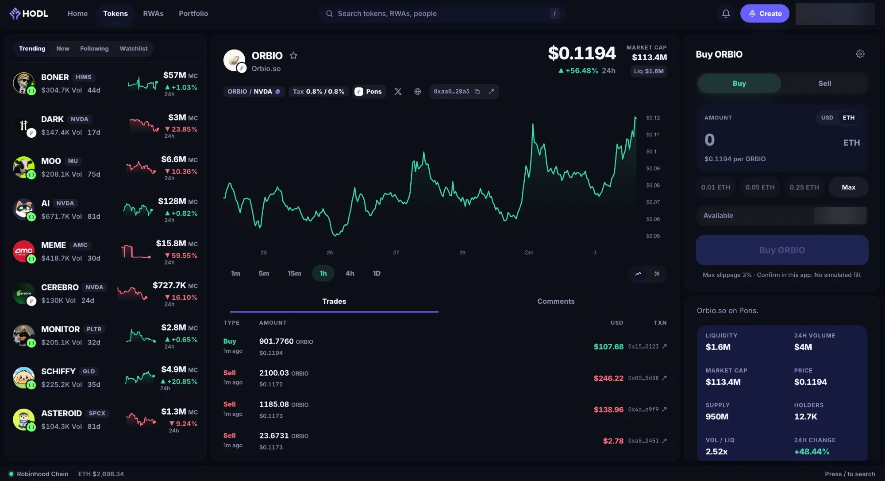
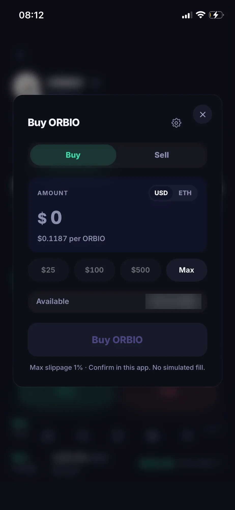
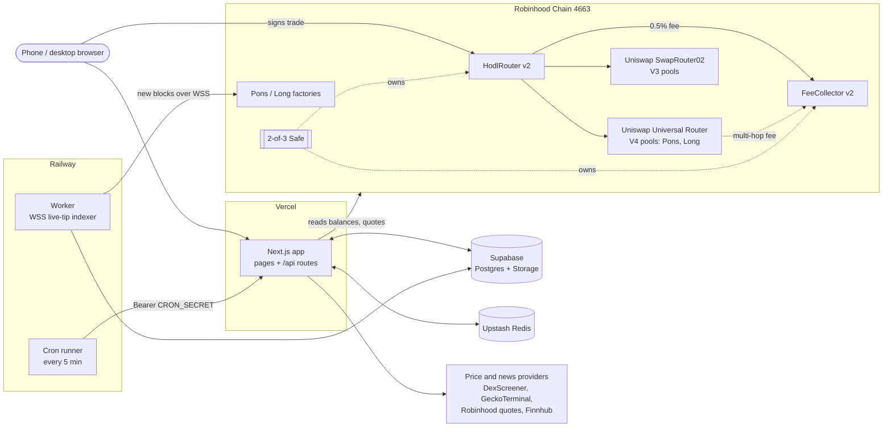

# HODL

**HODL lets anyone trade RWAs and the tokens paired with them on Robinhood Chain, on phone and desktop.**

> ### Built on Robinhood Chain
>
> - **Live:** [hodl.fan](https://hodl.fan)
> - **Demo video:** [DEMO_VIDEO_LINK]
> - **USDG:** Supports USDG, Robinhood Chain's stablecoin: pay and receive in USDG. Example: [buy FIG with 2 USDG through HodlRouter v2](https://robin.etherscan.io/tx/0xf123c6c15b92393927435b2f34d7ce7275896db4b5c4e790379d9e27376971d3) ([more](#built-with-paxos-usdg)).
> - **Contracts:** HodlRouter v2 and FeeCollector v2 on chain 4663, owned by a 2-of-3 Safe ([details](#smart-contracts))

## Judges: 2-minute check

1. **Open the app:** [hodl.fan](https://hodl.fan). Sign in, open any token, and the buy box quotes a live route.
2. **Look at three real trades through HodlRouter v2**, each paying 0.5% to the FeeCollector:
   - [Buy FIG, paid 2 USDG](https://robin.etherscan.io/tx/0xf123c6c15b92393927435b2f34d7ce7275896db4b5c4e790379d9e27376971d3) (`buyWithToken`)
   - [Buy ORBIO, paid 0.0007 ETH](https://robin.etherscan.io/tx/0xbd1c0c86fd5397193f1e210ccea700c87a740146f6aca2b2efab2521b44d1d31) (`buy`)
   - [Sell 18 ORBIO for ETH](https://robin.etherscan.io/tx/0x9531fbe93a0ef76c391cfe0ed02909eeb53883e8442fc47ac226e08edaa8356b) (`sell`)
3. **Check the contracts are verified** on robin.etherscan.io: [HodlRouter v2](https://robin.etherscan.io/address/0xBcf97C486DB56642BD27FCbE9CDeBed9A72468eb#code) and [FeeCollector v2](https://robin.etherscan.io/address/0x380b8Ced6F27c3800BA9F16796a34Ea74cC3BfCf#code), both exact match.
4. **Run the contract tests:** `npm run forge:test` (needs [Foundry](https://getfoundry.sh)) gives **95 passing**: unit, fuzz, invariant and attack tests, no network needed. The other **8 are fork tests** against real Pons and Long pools; they need a 4663 RPC and a recent `FORK_BLOCK`, because public RPCs keep only ~20 minutes of state ([how](contracts/README.md#tests)).

## The problem

Robinhood Chain has official tokenized stocks, and community launchpads (Pons and Long) where people launch tokens that trade against those stocks or pay holders in them. But it is hard to take part:

- **Finding the tokens.** Launchpad tokens are scattered across factories and pools. There is no single list, and no way to tell a token that really trades against a verified stock token from one that just uses a ticker in its name.
- **Trading them.** Many of these tokens sit in Uniswap V4 pools with launchpad hooks, or two hops away from ETH (ETH → USDG → stock → token). Generic swap UIs either can't route them or need several transactions.
- **Following the money.** There is nowhere to see what a portfolio of stocks and stock-paired tokens is worth, how it is split, or what other traders are doing.

## How HODL solves it

- **An indexed universe.** An on-chain indexer walks the Pons and Long factories and keeps every token whose pool is a verified RWA, or that pairs against ETH/USDG and pays holders in an RWA. The chain decides what exists, Supabase stores it, and price providers only add data to rows that already exist. If every provider is down, the lists still render.
- **One-transaction trades, on two routes.** Every trade is one transaction and pays the same 0.5% fee, but which contract runs it depends on the pool:
  - **Single-hop trades** (the token has a pool against ETH, WETH or USDG) go through **HodlRouter v2**, our contract. It does the V3 or V4 swap, takes the fee and enforces your minimum and the **$100 cap on-chain**.
  - **Multi-hop trades** (for example ETH → USDG → stock → token) go through **Uniswap's Universal Router**. HodlRouter only handles single-hop pools, so these can't use it. The app builds the route so the same 0.5% fee goes to our FeeCollector, and **the app enforces the $100 cap** before the wallet opens: there is no contract of ours in that path to enforce it.
- **A real portfolio.** Balances come from the chain across every connected wallet (Privy embedded wallet plus imported wallets). The portfolio view shows value over time, allocation, and target weights you can top up toward.
- **Social, built on trades.** Follow traders, see their verified on-chain fills, and comment on any token or stock.

## Features

| Feature | What it does |
| --- | --- |
| **Tokens feed** | Every indexed Pons and Long token in one sortable table (`/tokens`, and the feed on `/home`): New, Trending, market cap, volume, liquidity, buys and sells. Phones get the same list, in the same order. |
| **RWAs page** | Every verified stock token (`/rwas`) with its live price, the day's move, and how many tokens trade against it and their volume. |
| **Token pages with verified RWA** | `/token/[address]`: chart, trades tape, holders' comments, socials, and a badge naming the verified stock token the token trades against. `/rwa/[ticker]` shows the stock itself. |
| **Quick buy** | One-click buys straight from the Tokens table for a dollar amount you set once (default $25), saved to your profile. |
| **Portfolio** | `/profile`: on-chain holdings across all your wallets, value chart, allocation donut, and target weights per holding, with a "top up" rebalance that buys toward your targets. |
| **Create** | Launch a token on Pons from inside HODL, priced against a stock token (or ETH / USDG). The launch is read back from the chain before it is recorded. |
| **Follow traders** | Public profiles at `/u/[handle]`, follow / unfollow, a Following feed of verified HODL trades, and in-app alerts. |
| **USDG** | Pay with USDG on buys and receive USDG on sells, alongside ETH and WETH. |

## Screenshots

| Desktop | Phone |
| --- | --- |
|  |  |

## Built with Paxos USDG

[USDG](https://robin.etherscan.io/token/0x5fc5360d0400a0fd4f2af552add042d716f1d168) (Global Dollar, issued by Paxos) at `0x5fc5360D0400a0Fd4f2af552ADD042D716F1d168` is HODL's dollar:

- **Pay and receive in the trade box.** USD in the buy box pays USDG; USD in the sell box pays out USDG. ETH is the other choice. The portfolio shows USDG as a USD cash line at $1.00. Example: [buy FIG with 2 USDG through HodlRouter v2](https://robin.etherscan.io/tx/0xf123c6c15b92393927435b2f34d7ce7275896db4b5c4e790379d9e27376971d3).
- **Fees in USDG.** When USDG is the quote side of a trade, the 0.5% fee is taken in USDG and sent to the FeeCollector.
- **Limits priced in USDG.** The router's $1 minimum and $100 cap are compared in raw USDG units (`usdgRaw > maxNotionalUsd * 1e6`).
- **The ETH price comes from the WETH/USDG pool.** ETH amounts are converted with a 10-minute TWAP of the WETH/USDG 0.01% Uniswap V3 pool ([`0x52e65B17…71Ca`](https://robin.etherscan.io/address/0x52e65B17fB6E5BA00Ed806f37Afcd2DaA50271Ca)), through HodlRouter's `quoteUsdg`. The app uses the same call for its own cap check, so the two always agree.

## Smart contracts

Two contracts on Robinhood Chain (chain id 4663), Solidity `0.8.26`, built on OpenZeppelin Contracts v5.7.0. Full details: [`contracts/README.md`](contracts/README.md).

| Contract | Address | Source |
| --- | --- | --- |
| HodlRouter v2 | [`0xBcf97C486DB56642BD27FCbE9CDeBed9A72468eb`](https://robin.etherscan.io/address/0xBcf97C486DB56642BD27FCbE9CDeBed9A72468eb) | Verified (exact match) on [RobinScan](https://robin.etherscan.io/address/0xBcf97C486DB56642BD27FCbE9CDeBed9A72468eb#code) and [Sourcify](https://repo.sourcify.dev/4663/0xBcf97C486DB56642BD27FCbE9CDeBed9A72468eb) |
| FeeCollector v2 | [`0x380b8Ced6F27c3800BA9F16796a34Ea74cC3BfCf`](https://robin.etherscan.io/address/0x380b8Ced6F27c3800BA9F16796a34Ea74cC3BfCf) | Verified (exact match) on [RobinScan](https://robin.etherscan.io/address/0x380b8Ced6F27c3800BA9F16796a34Ea74cC3BfCf#code) and [Sourcify](https://repo.sourcify.dev/4663/0x380b8Ced6F27c3800BA9F16796a34Ea74cC3BfCf) |
| Owner of both | [`0xD6bD19742663ac1B1f5dd33aDB453E6DD9321aF8`](https://robin.etherscan.io/address/0xD6bD19742663ac1B1f5dd33aDB453E6DD9321aF8) | Safe 1.5.0, 2-of-3 |

**Fee.** 0.5% (50 bps) on the ETH / WETH / USDG side of every trade, sent to `FeeCollector`. Fee changes are capped at 1% in the contract and wait 2 days behind a timelock.

**How a trade flows.**

1. The app picks a route and gets a quote, then sets `minAmountOut` from your slippage setting.
2. You sign one transaction to `HodlRouter`: `buy` (ETH in), `buyWithToken` (USDG or WETH in) or `sell` (token in; ETH, WETH or USDG out).
3. The router checks the deadline and the pool hint. Only V3 pools and the known Pons and Long V4 hooks are allowed.
4. On a buy it takes the 0.5% fee from the input; on a sell it takes it from the output. The fee goes straight to `FeeCollector`.
5. It swaps through Uniswap V4 (Universal Router) or V3 (SwapRouter02), building the swap itself. It never accepts router commands from the caller.
6. It pays you and checks **what you actually received** against `minAmountOut`, then checks that it holds no more of any token than before the trade. Otherwise the whole trade reverts.

**Which route a trade takes.** HodlRouter v2 handles **single-hop** trades only: one pool, with ETH, WETH or USDG on one side. That is where the 0.5% fee, your minimum and the $100 cap are all enforced **on-chain**. A token that is two hops away (ETH → USDG → stock → token) has no such pool, so the app sends it through **Uniswap's Universal Router** instead. The transaction still pays the same 0.5% to `FeeCollector` (a `PAY_PORTION` or `TRANSFER` step the app adds), and the app enforces the $100 cap and your minimum before the wallet opens, since no HodlRouter check runs on that path.

**Live trades through v2** (each paid exactly 0.5% to the v2 FeeCollector and received at least its minimum):

- Buy FIG with 2 USDG (`buyWithToken`): [`0xf123c6c1…71d3`](https://robin.etherscan.io/tx/0xf123c6c15b92393927435b2f34d7ce7275896db4b5c4e790379d9e27376971d3)
- Buy ORBIO with 0.0007 ETH (`buy`): [`0xbd1c0c86…1d31`](https://robin.etherscan.io/tx/0xbd1c0c86fd5397193f1e210ccea700c87a740146f6aca2b2efab2521b44d1d31)
- Sell 18 ORBIO for ETH (`sell`): [`0x9531fbe9…356b`](https://robin.etherscan.io/tx/0x9531fbe93a0ef76c391cfe0ed02909eeb53883e8442fc47ac226e08edaa8356b)

**Ownership.** Both contracts are owned by a 2-of-3 Safe, so every admin action (pause, timelocked changes, fee withdrawal) needs two signatures. Ownership can only be handed over in two steps and can never be renounced.

## Security

- **Trades are capped at $100 while the contracts are unaudited.** The cap is set by our Safe and any change is timelocked for 2 days. We raise it after an audit.
- **Self-audit, with fixes shipped in v2:**
  - **Donation DoS (High).** v1 required the router's balances to be zero after every trade, so anyone could send it 1 wei of USDG and block all trading. v2 only requires that balances are no higher than before the trade.
  - **V4 encoding.** v1 encoded V4 swap params as flat fields, which the Universal Router read as a struct offset, so only native-ETH pools worked. v2 encodes `ExactInputSingleParams` and is fork-tested on Pons ETH, Pons USDG and Long WETH pools.
  - **V3 multi-hop `SliceOutOfBounds`.** The app's Universal Router call for multi-hop trades (ETH → USDG → stock → token) left out UR 2.1's `maxHopSlippage` array, so every such trade reverted. Fixed in the app's encoder (`src/lib/swapTx.ts`), with a regression test.
  - Also fixed: seller minimum now checked after the fee, two-step ownership, 2-day timelock on fee / cap / venue changes, a 10-minute TWAP for the size limits, and a FeeCollector that can always be withdrawn.
- **OpenZeppelin Contracts v5.7.0:** `Ownable2Step`, `ReentrancyGuardTransient`, `SafeERC20`, `SafeCast`.
- **Why the app asks for an unlimited approval, once per token.** HodlRouter has exactly one place that pulls tokens, and it only ever pulls from the wallet calling it, for that trade's amount:
  ```solidity
  IERC20(token).safeTransferFrom(msg.sender, address(this), amountIn);   // HodlRouter.sol, _pullExact
  ```
  No function takes a target or calldata from the caller, and the contract isn't upgradeable, so an allowance to it can't be used to move your tokens outside your own trade. Multi-hop trades use Permit2 with a 30-day allowance to Uniswap's Universal Router, which only spends it when you call it. Details: [`contracts/README.md`](contracts/README.md#approvals).
- **103 tests:** 95 unit, fuzz, invariant and attack tests that run offline (`npm run forge:test`), plus 8 fork tests against real Pons and Long pools.
- **100% branch coverage** (123/123 branches, 417/417 statements) on `HodlRouter` and `FeeCollector`.
- **Slither: 0 High.** Every Medium and Low was reviewed; see [`contracts/README.md`](contracts/README.md#tests).
- **Contracts CI** ([`.github/workflows/contracts.yml`](.github/workflows/contracts.yml)): format, build, tests, a ≥95% branch-coverage gate, and Slither failing on any High.

Details and how to report a bug: [`SECURITY.md`](SECURITY.md).

## Architecture



- **UI and API:** Next.js 15 on Vercel. Pages render from Supabase; Redis holds the built feeds so a cold instance doesn't rebuild them.
- **Worker:** an always-on Railway service (`npm run worker`, [`railway.toml`](railway.toml)) that follows new blocks over WebSocket and indexes Pons and Long launches into Supabase. One replica, guarded by a Postgres advisory lock.
- **Cron:** a second Railway service (`npm run cron:railway`, [`railway.cron.toml`](railway.cron.toml)) that calls the `/api/cron/*` routes every five minutes for stats, prices, sparklines and rewards, and warms the page caches.

## Tech stack

| Layer | Tools |
| --- | --- |
| App | Next.js 15 (App Router), React 19, TypeScript, Tailwind CSS |
| Wallets | Privy (embedded wallets, login), wagmi 3, viem 2, Reown / WalletConnect |
| Charts | lightweight-charts |
| Data | Supabase (Postgres, Storage), `pg` for the worker, Upstash Redis |
| Contracts | Solidity 0.8.26, Foundry, OpenZeppelin Contracts v5.7.0, Uniswap V3 / V4 |
| Hosting | Vercel (app), Railway (worker + cron) |
| Market data | DexScreener, GeckoTerminal / CoinGecko, Robinhood quotes, Finnhub |
| CI | GitHub Actions: typecheck, contracts (tests, coverage gate, Slither) |

## Routes

| Route | What it is |
| --- | --- |
| `/` | Login (Privy). Without Privy configured, a demo login faked in the browser |
| `/home` | Desktop: summary. Phone: the feed, with Tokens / RWAs / Watchlist tabs |
| `/tokens` | Every listed token in one sortable table, with quick buy |
| `/rwas` | Every verified stock token, with the tokens paired against it |
| `/token/[address]` | Token page: chart, tape, verified RWA pair, comments, trade box |
| `/rwa/[ticker]` | Stock token page |
| `/search` | Search RWAs, tokens and people. An unknown address is checked live and added if it qualifies |
| `/profile` | Your portfolio: holdings across all wallets, value chart, allocation and targets |
| `/u/[handle]` | Someone else's public profile and holdings; follow them from here |
| `/activity` | Phone: Following feed and alerts |
| `/create` | Opens the launch sheet over the feed (`/home?create=1`) |
| `/news`, `/news/[id]` | News coverage |
| `/health` | Status page: database and Redis latency, cache age, indexer and price-job lag |
| `/api/cron/*` | `index-tokens`, `discovery`, `stats`, `prices`, `sparks`, `rewards`. All need `Authorization: Bearer $CRON_SECRET` |

## Run locally

Requirements: Node ≥ 22.12, npm. For contracts: [Foundry](https://getfoundry.sh).

```bash
git clone --recurse-submodules https://github.com/hawabuilds/rwa.git
cd rwa
npm ci
cp .env.local.example .env.local
npm run dev
```

Open http://localhost:3000. With an empty `.env.local` the app starts in demo mode: login is faked in the browser, RWA prices and news load, and token lists are empty because there is no database. To fill them, set up Supabase (below). Every variable, and where to get it, is documented in [`.env.local.example`](.env.local.example).

### Database (Supabase)

Create a Supabase project, then run these files from `scripts/` in the Supabase SQL editor, **in this order**. Each one is safe to re-run.

| # | File | Notes |
| --- | --- | --- |
| 1 | `schema.sql` | Base tables: users, comments, follows, tokens, token_stats, indexer_state, … |
| 2 | `schema-universe.sql` | Enables `pg_trgm`; token universe columns, `token_pools` |
| 3 | `schema-pools.sql` | |
| 4 | `schema-images.sql` | |
| 5 | `schema-image-cdn.sql` | Creates the public `token-images` Storage bucket |
| 6 | `schema-socials.sql` | |
| 7 | `schema-tradeable.sql` | |
| 8 | `schema-priced.sql` | |
| 9 | `schema-eligible.sql` | Only one statement is active (adds the column). Run it alone |
| 10 | `schema-eligible-index.sql` | On a database that already has tokens, run this after `npm run backfill:eligible` |
| 11 | `schema-backfill.sql` | |
| 12 | `schema-batch-cursors.sql` | |
| 13 | `schema-live-heartbeat.sql` | |
| 14 | `schema-news-articles.sql` | |
| 15 | `schema-portfolio-snapshots.sql` | |
| 16 | `schema-notifications.sql` | |
| 17 | `schema-launches.sql` | |
| 18 | `schema-comment-likes.sql` | |
| 19 | `schema-following.sql` | |
| 20 | `schema-allocation-targets.sql` | |
| 21 | `schema-price-refresh.sql` | |
| 22 | `schema-tokens-table.sql` | |
| 23 | `schema-tokens-table-indexes.sql` | `CREATE INDEX CONCURRENTLY`: run **one statement at a time** |
| 24 | `schema-tokens-table-liquidity.sql` | Replaces `hodl_token_page`; must come after 22 |
| 25 | `schema-rwas-tab.sql` | Must come after 22 |
| 26 | `schema-home-banner.sql` | |

Not part of a fresh setup: `schema-eligible-batch.sql` and `schema-eligible-index-concurrent.sql` are recovery scripts for large existing tables (see the comments at the top of each).

Then set `NEXT_PUBLIC_SUPABASE_URL`, `NEXT_PUBLIC_SUPABASE_ANON_KEY`, `SUPABASE_SERVICE_ROLE_KEY` and, for the worker and scripts, `DATABASE_URL` in `.env.local`.

### Fill the token universe

```bash
npm run verify:chain        # checks your RPC reaches chain 4663 and the known contracts have code
npm run backfill:universe   # walks the Pons and Long factories into `tokens`
npm run backfill:pools      # real Uniswap pools per token
npm run backfill:eligible   # eligibility flag (then run schema-eligible-index.sql)
npm run backfill:images     # logos into Supabase Storage
npm run backfill:prices     # first on-chain price for every token
```

The backfills page through the chain with checkpoints (`backfill_cursors`, `batch_cursors`), so they can be stopped and rerun. Use an `ALCHEMY_RPC_URL` for the first fill; the public RPC is rate-limited.

### Worker and cron

```bash
npm run worker        # live-tip indexer: follows new blocks over WSS (polls without one)
npm run cron:railway  # one cron tick: calls /api/cron/* on CRON_ORIGIN with CRON_SECRET
```

- The **worker** needs the Supabase variables and `DATABASE_URL`. It takes a Postgres advisory lock, so only one copy runs at a time. In production it runs on Railway from [`railway.toml`](railway.toml).
- The **cron runner** needs `CRON_ORIGIN` (or `VERCEL_APP_URL`) and `CRON_SECRET`. Locally, point it at your dev server: `CRON_ORIGIN=http://localhost:3000`. In production it is a second Railway service from [`railway.cron.toml`](railway.cron.toml), every five minutes.
- You can also call a single job by hand: `curl -H "Authorization: Bearer $CRON_SECRET" http://localhost:3000/api/cron/index-tokens`.

## Tests

```bash
npm run typecheck       # tsc --noEmit (also runs in CI)
npm test                # node:test unit tests in test/
npm run build           # production build
```

Contracts (from the repo root):

```bash
npm run forge:test       # unit, fuzz, invariant, attack: 95 tests, no network
npm run forge:coverage   # coverage, fork suite excluded
npm run forge:test:fork  # 8 fork tests against real Pons / Long / V3 pools
```

**Fork tests.** They fork Robinhood Chain at a pinned `FORK_BLOCK` through the `rh` endpoint (`ALCHEMY_RPC_URL`). The public RPC keeps only about 20 minutes of state, so on a new machine:

1. Set `ALCHEMY_RPC_URL` to any chain 4663 RPC. The public `https://rpc.mainnet.chain.robinhood.com` works for a recent block.
2. Set `FORK_BLOCK` in `contracts/test/HodlRouterFork.t.sol` to a block from the last few minutes (`cast block-number --rpc-url <rpc>`, minus ~100).
3. Run `npm run forge:test:fork` straight away.

Foundry caches the forked state on disk, so later reruns at the same block work offline. Without that cache, or an archive RPC, a stale block fails (it never skips). If you just ran coverage, run `forge clean` (or add `--force`) first, otherwise forge can report "no tests match". More in [`contracts/README.md`](contracts/README.md).

## Repo layout

| Path | What |
| --- | --- |
| `src/app` | Next.js pages and `/api` routes |
| `src/components`, `src/hooks` | UI |
| `src/lib` | Chain, swap encoding, data access; `src/lib/server` is server-only |
| `src/worker` | Railway live-tip indexer |
| `contracts` | Foundry project: `HodlRouter`, `FeeCollector`, tests, deploy script |
| `scripts` | Schema SQL, backfills, Railway cron runner |
| `test` | node:test unit tests |

## License

[MIT](LICENSE)
